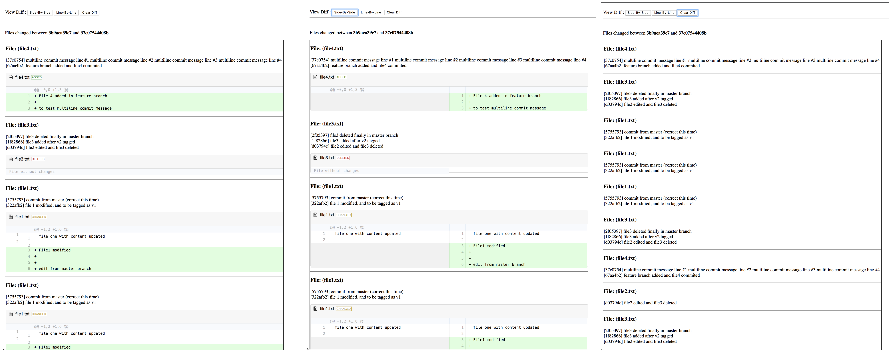

# Whatchanged?

This is a simple bash script to help me share a report of file changed between two commits. I [started](https://gist.github.com/palaniraja/2bb7d7d64eef279e683b43e19c56c555) this as I could not find a way to `pipe` the `git log` output with `xargs`. 

Anyhow, bash script ended up better options for writing it as html for other posibilities.

There were about atleast three different implementation of the script, refer [history](https://github.com/palaniraja/whatchanged/commit/30f731dfcd4bec2be3a023a09150e076b03e9738) of `whatchanged.sh` to see other revisions of the script.


## How to use 

```
# sh whatchanged.sh <startCommitSHA> <endCommitSHA>
```

e.g.,
```
sh whatchanged.sh 3b9aea39c7 37c07544408b
```

## Output



## TODO:

- [x] Commit logs by file
- [x] Excel friendly html table
- [x] With source diff 
- [x] Diff options: side-by-side or line-by-line and clear 
- [ ] Filter files with certain extensions
- [ ] Style & Typography - not happy with it
- [ ] HTML Filter by file types?


A lot of dirty tricks involved, but hey it gets the job done. Will try to tidy up _later*_


Feel free to send me a pull requests